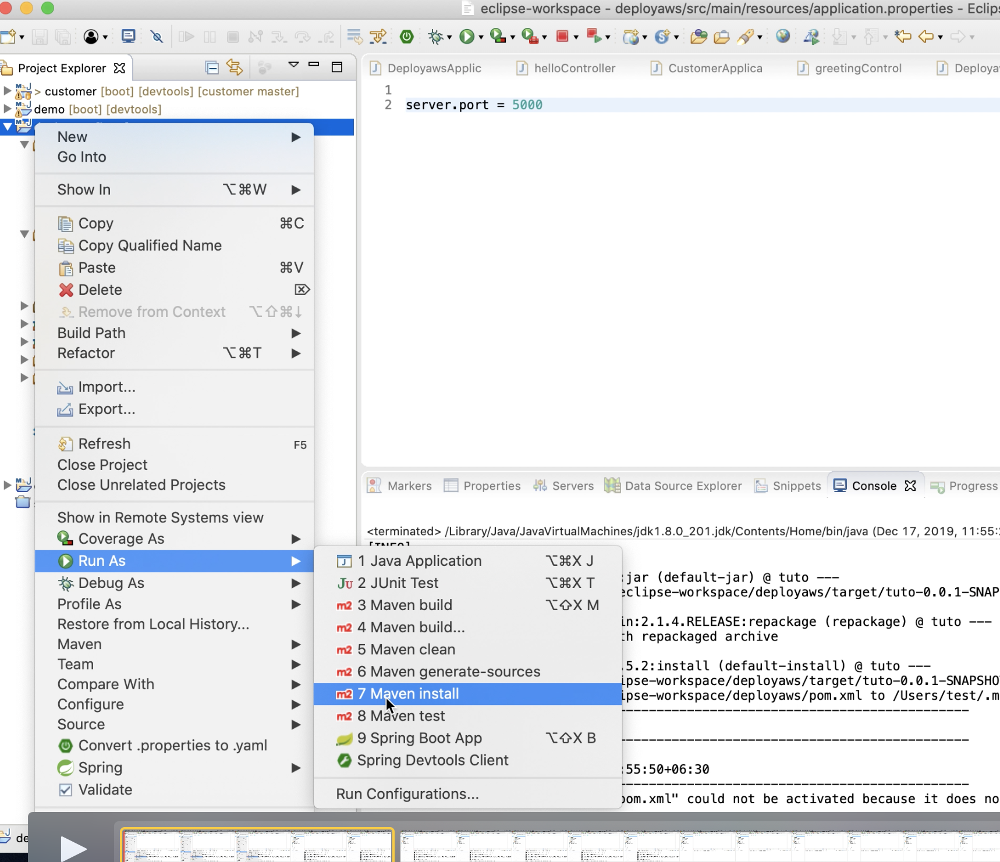
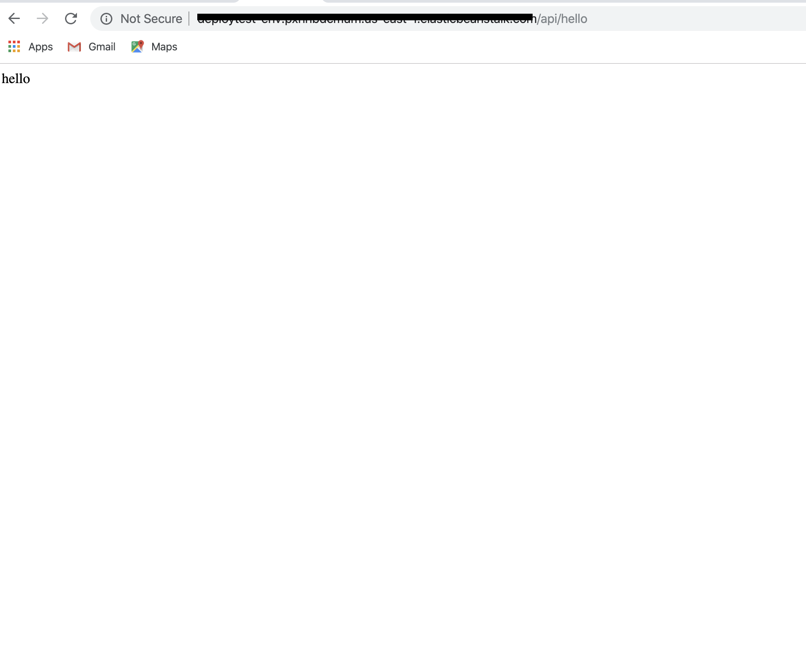
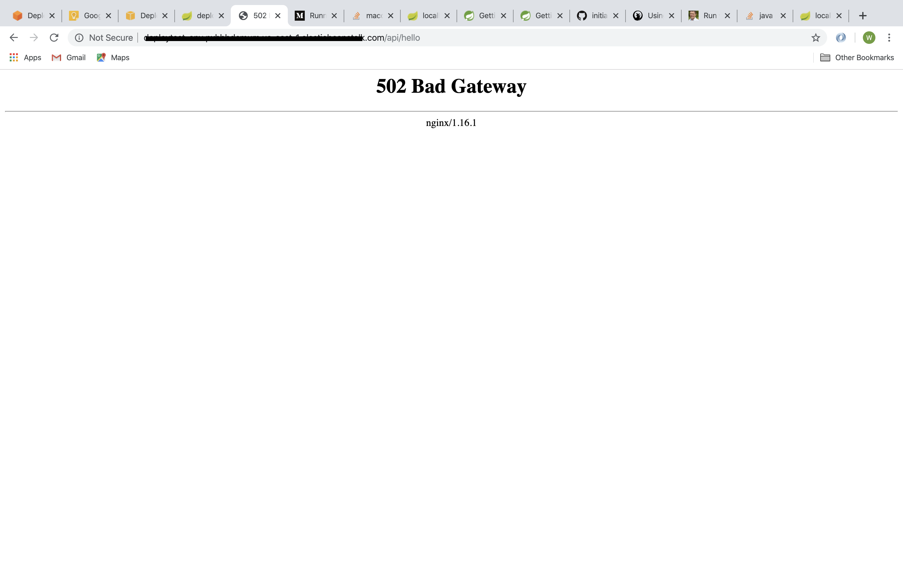

### Spring Boot Deploy To Aws 

## Information 

Spring Sample No Data Base  Application Deploy to Aws 

Aws Service : elasticbeanstalk

- Requirement : Aws Account 
                elasticbeanstalk 
                Spring application 

### Step By Step 

- Step 1 Change Defalut port to 5000 Beacuse aws use this port otherwise show defalut gate way error 

- Step 2 Export Jar your Spring application 

- Step 3 Create elasticbeanstalk Web server applicaion 

- Step 4 Upload Jar File 

- Result 

- Error case Defalut gate way error 

- Error solution change port number appliacation.properties

